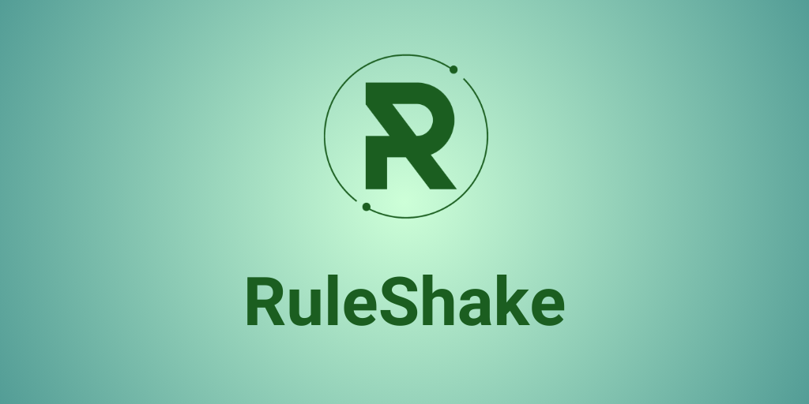
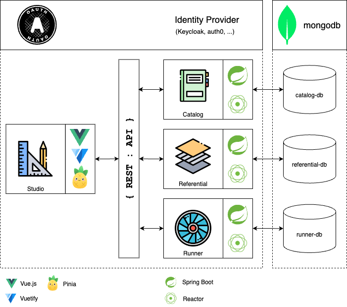
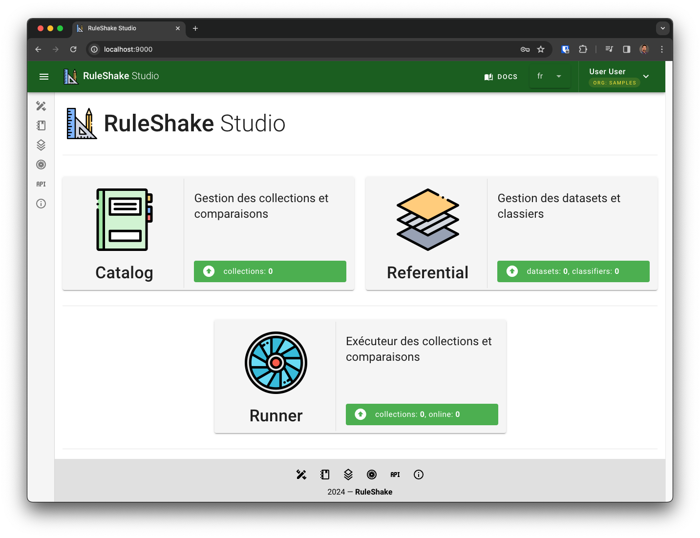

<p align="center">
  <a href="https://ruleshake.com/"></a>
</p>

<p align=center>
RuleShake is a headless, high-performance and scalable calculation engine.
<br />
Define your rules simply and let RuleShake offer the best personalized package to your customers.
</p>

<p align="center">
  <a href="https://ruleshake.com/docs/intro">Docs</a> - <a href="https://ruleshake.com/blog/">Blog</a> - <a href="https://demo.ruleshake.com">Demo</a>
</p>

<p align="center">
Ruleshake is made up of Studio which is its configuration interface, Catalog which is the service for creating and 
configuring variable collections, Referential the dataset management service and Runner the variable collection evaluation service.
</p>

<p align="center">
  <a href="https://ruleshake.com/blog/architecture"></a>
</p>

# We host

RuleShake SaaS offer is under development. 
However, you can access effortlessly to the [demo environment](https://studio-demo.ruleshake.com) 
and discover what it is possible to do with RuleShake suite.

# You host

## Requirements

Install `Docker Compose`: https://docs.docker.com/compose/install/

Add a new entry in your `/etc/hosts` (Linux) or `C:\Windows\System32\drivers\etc\hosts` (Windows) :

```shell
127.0.0.1 keycloak
```

> [!NOTE]
> This is required because the issuer of the access token got from Studio should have the same origin as the issuer used
> by back services to validate tokens.
>
> You don't have to do that if you're running Keycloak (or another identity provider) somewhere accessible both inside 
> the docker compose with the same name.

## Configuration

Check the [.env](.env) file.

### Ports mapping

| Variable                     | Default value |
|------------------------------|---------------|
| `KEYCLOAK_PORT`              | `9090`        |
| `MONGO_EXPRESS_PORT`         | `9091`        |
| `RULESHAKE_STUDIO_PORT`      | `9000`        |
| `RULESHAKE_CATALOG_PORT`     | `9001`        |
| `RULESHAKE_RUNNER_PORT`      | `9002`        |
| `RULESHAKE_REFERENTIAL_PORT` | `9003`        |

### Keycloak

At starting of Keycloak, a realm named `ruleshake-${KEYCLOAK_RULESHAKE_ORGANIZATION}` is created.
The default value of `KEYCLOAK_RULESHAKE_ORGANIZATION` is `sample`, you can change it in [.env](.env) file.

The realm contains a client named `ruleshake-studio` used by Studio to authenticate users. 
This client, via it's service account, can be used to retrieve a token and call RuleShake services REST API.
You can create a dedicated client in keycloak to separate user operations from machine-to-machine calls

Users `user` and `guest` are created. `user` can do CRUD actions when `guest` has only read-only access.

### MongoDB

At starting of mongodb, a replicaSet is initialized. 
Even if there is only one node of mongo, the replicaSet is required to do some operations such as transactions.

To simplify starting, security is disabled when interacting with mongo. 
That said, mongo is exposed only inside the docker compose network. 
Mongo Express, a web-based MongoDB admin interface, is secured by a basic authentication (find credentials in [.env](.env) file).

## Start

```shell
git clone https://github.com/ruleshake/ruleshake-start.git
cd ruleshake-start
docker compose up
```

### Studio

Access to RuleShake Studio on `http://localhost:9000` and login with `user`:`user` or `guest`:`guest`.

<p align="center">
  
</p>

### API

To use ruleshake services API, first get an access token from Keycloak:

```shell
curl --location 'http://keycloak:9090/realms/ruleshake-samples/protocol/openid-connect/token' \
--header 'Content-Type: application/x-www-form-urlencoded' \
--data-urlencode 'client_id=ruleshake-studio' \
--data-urlencode 'client_secret=changeit' \
--data-urlencode 'grant_type=client_credentials'
```

Then, call the desired API using the token you just retrieved. Example of evaluating a collection of variables in
RuleShake Runner:

```shell
curl --location 'http://localhost:9002/api/v1/evaluations' \
--header 'Content-Type: application/json' \
--header 'Authorization: Bearer <access_token>' \
--data '{
  "requestTime": "2024-02-14T13:37:00.000Z",
  "collectionCode": "TEST",
  "inputs": [
      {
          "reference": "test",
          "value": "test",
          "type": "string"
      }
  ]
}'
```